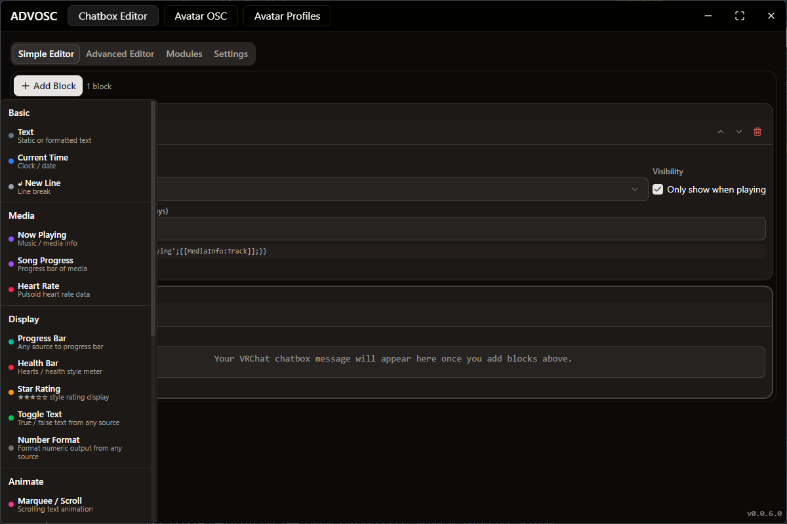
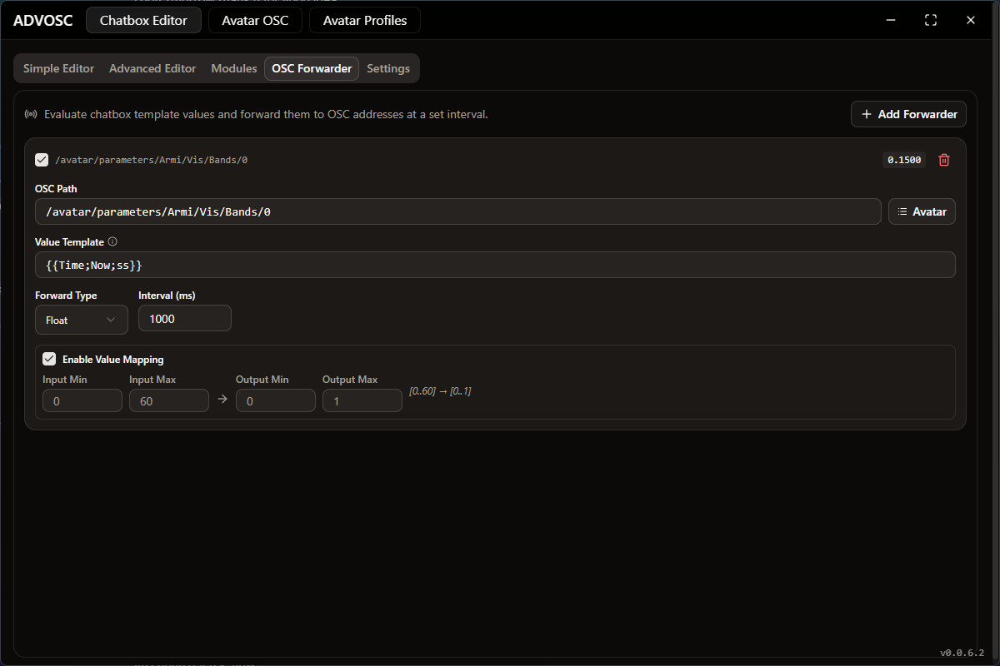

<p align="center">
  
</p>

<h1 align="center">ADVOSC</h1>

<p align="center">
  <a href="https://discord.gg/spfmB7S78n">
    
  </a>
  
  <a href="https://github.com/TheArmagan/advosc/releases/latest">
    
  </a>
  
</p>

ADVOSC is a desktop app for VRChat OSC. It started because I wanted a nicer chatbox than the ones I could find, and it grew from there: a chatbox template engine you can build with blocks or write by hand, avatar parameter control and profiles, avatar scaling, and an OSC forwarder.

Windows only, since a few parts (media info, trackers, hardware sensors) talk to Windows APIs directly.

Grab a build from [Releases](https://github.com/TheArmagan/advosc/releases/latest), or come say hi on [Discord](https://discord.gg/spfmB7S78n) if something breaks.

---

## The chatbox

Everything in the chatbox is a template. You write text, and anywhere you want live data you drop in a placeholder like `{{MediaInfo;Track}}`. ADVOSC re-renders it every 2.2 seconds (VRChat's rate limit) and sends the result.

There are two ways to write one, and they both end up as the same template underneath, so you can start in one and finish in the other.

### Simple editor

<p align="center">
  
</p>

You stack blocks, reorder them, and watch the preview update as you go. No syntax to memorize. There are 30 block types:

| Category | Blocks |
|----------|--------|
| **Basic** | Text, Text Transform, Text Replace, Text Truncate, Text Pad, Text Fallback, Current Time, New Line |
| **Media** | Now Playing, Song Progress, Heart Rate |
| **Display** | Progress Bar, Health Bar, Star Rating, Toggle Text, Number Format |
| **Animate** | Marquee / Scroll, Bounce, Typewriter, Blink, Cycle Texts |
| **Logic** | Condition |
| **VRChat** | Hotkey State, Avatar Param, VR Tracker |
| **Tools** | Stopwatch, Session Time, Shortcut, Number Calc, Random Number |

The part that makes it actually usable for real templates: most blocks accept more than a plain value as their source. You can feed them:

- a literal like `42`, `true`, or some text
- an OSC address like `/avatar/parameters/Health`
- an inner placeholder like `[[MediaInfo:Duration]]`
- a full placeholder like `{{Shortcut;Time}}`

So mixing media data, tracker battery, heart rate, hotkeys and conditions in one visual flow works fine. A few things people tend to build:

- a now playing line that falls back to something else when nothing is playing
- a song progress bar with a moving head character
- a status line driven by a hotkey or an avatar parameter
- a weather line with a condition emoji, temperature and sunset time
- long media titles truncated so they fit, HP padded so the layout stops jumping
- numbers clamped, mapped into another range, rounded, or randomized
- marquee, blink, typewriter, rotating messages
- AFK or stream status that swaps text depending on a condition

### Advanced editor

<p align="center">
  
</p>

If you would rather just write the template, this is a real editor with autocomplete for every module and placeholder. Nothing is hidden from you here, and anything the simple editor can produce you can also write by hand.

Whichever editor you have open is the one that gets sent.

### My Templates

A saved template holds the whole setup: the template text, both editors' state, and every module's settings. So switching templates swaps your entire chatbox in one click instead of you rebuilding it.

| Action | What it does |
|--------|--------------|
| **Save Current As Template** | Snapshots your current setup under a name |
| **Use** | Switches to a saved template, and can save your current one first so you can come back |
| **Overwrite With Current Setup** | Updates a saved template in place after you tweak something |
| **Share** | Gives you a compact share code, the raw JSON, or a `.advosc.json` file |
| **Import** | Takes a share code, template JSON, template file, or an old "Export All Settings" bundle |

Sharing strips your credentials. Heart rate tokens, API keys, widget ids, custom WebSocket URLs and shortcuts you marked hidden never leave your machine, and the share window tells you exactly what it removed. There is a checkbox to include them on purpose if you are exporting a backup for yourself.

Imported templates just land in your list. Nothing switches until you say so.

---

## Modules

Both editors run on the same 15 modules. Click one to see what it does.

<details>
<summary><strong>🎵 Media Info</strong> :: whatever you are listening to</summary>

Reads Windows' own media session, so it works with Spotify, browsers, most players. Synced lyrics included when they exist.

| Placeholder | Output | Description |
|-------------|--------|-------------|
| `{{MediaInfo;Status}}` | `Playing` | Playback status (Playing, Paused, Stopped) |
| `{{MediaInfo;Track}}` | `Never Gonna Give You Up` | Track title |
| `{{MediaInfo;Artist}}` | `Rick Astley` | Artist name |
| `{{MediaInfo;Album}}` | `Whenever You Need Somebody` | Album name |
| `{{MediaInfo;Position}}` | `120000` | Current position in milliseconds |
| `{{MediaInfo;Duration}}` | `300000` | Total duration in milliseconds |
| `{{MediaInfo;AppName}}` | `Spotify` | Which app is playing it |
| `{{MediaInfo;Lyric}}` | `Never gonna give you up` | Current synced lyric line |

</details>

<details>
<summary><strong>🕒 Time</strong> :: clocks, dates, durations</summary>

| Placeholder | Output | Description |
|-------------|--------|-------------|
| `{{Time;NowMillis}}` | `1700000000000` | Current time in milliseconds (Unix epoch) |
| `{{Time;Now;HH:mm}}` | `14:30` | Current time, your format |
| `{{Time;Now;yyyy-MM-dd}}` | `2023-11-14` | Current date, your format |
| `{{Time;Timezone}}` | `America/New_York` | System timezone |
| `{{Time;UTCOffset}}` | `+00:00` | Current UTC offset |
| `{{Time;FormatDuration;3600000;Short}}` | `1h 0m 0s` | Milliseconds as a readable duration |
| `{{Time;ElapsedMillis;...}}` | `5000` | Time since a timestamp |

</details>

<details>
<summary><strong>🔤 Text</strong> :: transforms, bars, animations</summary>

The biggest module. Transform text, build meters out of it, animate it.

| Placeholder | Output | Description |
|-------------|--------|-------------|
| `{{Text;Upper;hello}}` | `HELLO` | Uppercase |
| `{{Text;Lower;HELLO}}` | `hello` | Lowercase |
| `{{Text;Title;hello world}}` | `Hello World` | Title case |
| `{{Text;Trim;  hello  }}` | `hello` | Strip surrounding whitespace |
| `{{Text;Replace;cat;dog;cat nap}}` | `dog nap` | Replace every match |
| `{{Text;Length;hello}}` | `5` | Length |
| `{{Text;Reverse;hello}}` | `olleh` | Reverse it |
| `{{Text;Repeat;3;Hi }}` | `Hi Hi Hi ` | Repeat N times |
| `{{Text;Slice;0;5;Hello World}}` | `Hello` | Substring |
| `{{Text;Format;Rounded;text}}` | `ⓣⓔⓧⓣ` | Unicode styling |
| `{{Text;Format;Bold;text}}` | `𝐭𝐞𝐱𝐭` | One of the newer styles |
| `{{Text;Truncate;10;Long text...}}` | `Long text...` | Cut with an ellipsis |
| `{{Text;Build;ProgressBar;30;100;10;█;░;▓}}` | `██▓░░░░░░░` | Progress bar, optional head character |
| `{{Text;Build;HealthBar;3;5;♥;♡}}` | `♥♥♥♡♡` | Hearts style meter |
| `{{Text;Build;StarRating;3;5;★;☆}}` | `★★★☆☆` | Rating display |
| `{{Text;Build;Toggle;true;ON;OFF}}` | `ON` | Truthy or falsy to text |
| `{{Text;NumberFormat;2;.;,;1234.5}}` | `1,234.50` | Format a number for display |
| `{{Text;Animate;Marquee;...}}` | `scrolling` | Marquee |
| `{{Text;Animate;Typewriter;Hello}}` | `H` → `He` → `Hel` | Reveal over time |
| `{{Text;Animate;Blink;ON;OFF}}` | `ON` → `OFF` | Alternate two texts |
| `{{Text;Animate;EachOne;A;B;C}}` | `A` → `B` → `C` | Cycle through items |

</details>

<details>
<summary><strong>🔢 Number</strong> :: math and randomness</summary>

| Placeholder | Output | Description |
|-------------|--------|-------------|
| `{{Number;Random;Int;1;100}}` | `42` | Random integer in a range |
| `{{Number;Random;Float;0;1}}` | `0.7531` | Random float in a range |
| `{{Number;Clamp;150;0;100}}` | `100` | Keep a value inside bounds |
| `{{Number;Map;5;0;10;0;100}}` | `50` | Remap one range onto another |
| `{{Number;Floor;3.7}}` | `3` | Round down |
| `{{Number;Ceil;3.2}}` | `4` | Round up |
| `{{Number;Round;3.5}}` | `4` | Round to nearest |
| `{{Number;Abs;-5}}` | `5` | Absolute value |

</details>

<details>
<summary><strong>🧪 Expression</strong> :: conditions and real math</summary>

When a condition gets too weird for the other modules, write it out.

| Placeholder | Output | Description |
|-------------|--------|-------------|
| `{{Expr;5 > 3;Yes;No}}` | `Yes` | If / else |
| `{{Expr;Math.sqrt(16)}}` | `4` | Math expressions |
| `{{Expr;Math.sin(Math.PI/2)}}` | `1` | Trig |
| `{{Expr;[[MediaInfo:Status]]=='Playing';🎵;⏸️}}` | `🎵` | Conditions on live data |

</details>

<details>
<summary><strong>❤️ Heart Rate</strong> :: Pulsoid, HypeRate, Stromno, custom</summary>

Add your feeds under **Modules → Heart Rate**. Each one gets a name that you use in the placeholder, so your token never ends up sitting inside a template you might share.

| Platform | What you need |
|----------|---------------|
| Pulsoid | Access token |
| HypeRate | API key + session id |
| Stromno | Widget id |
| Custom WebSocket | WebSocket URL + optional JSON path (like `data.heartRate`) |

| Placeholder | Output | Description |
|-------------|--------|-------------|
| `{{HeartRate;SOURCE;HeartRate}}` | `75` | Current heart rate |
| `{{HeartRate;SOURCE;IsOnline}}` | `true` | Connection status |
| `{{HeartRate;SOURCE;AverageHR;300}}` | `72` | Average over N seconds (max 900) |
| `{{HeartRate;SOURCE;MaxHR}}` | `120` | Session maximum |
| `{{HeartRate;SOURCE;MinHR}}` | `55` | Session minimum |

> Old templates using `{{Pulsoid;TOKEN;…}}` migrate themselves: the token becomes a named source and the template gets rewritten. `Pulsoid` still works as an alias too.

</details>

<details>
<summary><strong>📡 OSC Data</strong> :: raw avatar parameters</summary>

| Placeholder | Output | Description |
|-------------|--------|-------------|
| `{{OSCData;/avatar/parameters/AFK}}` | `true` | Any OSC parameter value |
| `{{OSCData;/avatar/parameters/VelocityX}}` | `0.5` | Floats too |

</details>

<details>
<summary><strong>🎮 OpenVR Trackers</strong> :: battery and status</summary>

<p align="center">
  
</p>

| Placeholder | Output | Description |
|-------------|--------|-------------|
| `{{OVRTrackers;BatteryLevel;finder}}` | `85` | Battery level (0-100) |
| `{{OVRTrackers;IsCharging;finder}}` | `true` | Charging or not |
| `{{OVRTrackers;ModelNumber;finder}}` | `Vive Tracker 3.0` | Model |
| `{{OVRTrackers;SerialNumber;finder}}` | `LHR-12345678` | Serial |
| `{{OVRTrackers;IsExists;finder}}` | `true` | Whether it is there at all |

The finder can be a device index, serial number, device class, or model number.

</details>

<details>
<summary><strong>⚙️ Process</strong> :: is it running, and for how long</summary>

| Placeholder | Output | Description |
|-------------|--------|-------------|
| `{{Process;IsRunning;VRChat.exe}}` | `true` | Running or not |
| `{{Process;StartedAt;VRChat.exe}}` | `1700000000000` | Start timestamp |
| `{{Process;SessionTime;VRChat.exe}}` | `3600000` | Time since it started |

</details>

<details>
<summary><strong>🖥️ System Resources</strong> :: CPU, GPU, memory, network</summary>

What your PC is doing right now, sampled by a native helper twice a second.

**CPU**

| Placeholder | Output | Description |
|-------------|--------|-------------|
| `{{System;CPUName}}` | `AMD Ryzen 9 7950X 16-Core Processor` | Processor name |
| `{{System;CPUUsage}}` | `13.7` | Overall usage percentage |
| `{{System;CPUCoreUsage;0}}` | `24.5` | One logical core, zero based index |
| `{{System;CPUCores}}` | `16` | Physical core count |
| `{{System;CPUThreads}}` | `32` | Thread count |
| `{{System;CPUFrequency}}` | `4501` | Current frequency in MHz |
| `{{System;CPUTemperature}}` | `62` | Celsius, empty when Windows exposes no sensor |

**Memory**

| Placeholder | Output | Description |
|-------------|--------|-------------|
| `{{System;MemoryUsed}}` | `31.2 GB` | In use |
| `{{System;MemoryTotal}}` | `127.2 GB` | Total physical memory |
| `{{System;MemoryAvailable}}` | `95.9 GB` | Available to applications |
| `{{System;MemoryUsage}}` | `24.6` | Usage percentage |
| `{{System;SwapUsed}}` | `0 B` | Page file in use |
| `{{System;SwapTotal}}` | `8 GB` | Total page file size |
| `{{System;SwapUsage}}` | `0.0` | Page file usage percentage |

**GPU.** Every GPU placeholder takes an optional finder as its first parameter: a zero based index, or part of the name or vendor. Leave it empty and you get the GPU with the most VRAM, which is the discrete card on a laptop or APU system.

| Placeholder | Output | Description |
|-------------|--------|-------------|
| `{{System;GPUName}}` | `NVIDIA GeForce RTX 3070 Ti` | GPU name |
| `{{System;GPUVendor}}` | `NVIDIA` | NVIDIA, AMD, Intel or Unknown |
| `{{System;GPUUsage}}` | `42.0` | Utilization percentage |
| `{{System;VRAMUsed}}` | `2.7 GB` | VRAM in use |
| `{{System;VRAMTotal}}` | `8 GB` | Total VRAM |
| `{{System;VRAMUsage}}` | `34.3` | VRAM usage percentage |
| `{{System;GPUTemperature}}` | `53` | Celsius, NVIDIA only |
| `{{System;GPUPower}}` | `52.1` | Watts, NVIDIA only |
| `{{System;GPUFanSpeed}}` | `0` | Fan percentage, NVIDIA only |
| `{{System;GPUCoreClock}}` | `1020` | Core clock in MHz, NVIDIA only |
| `{{System;GPUCount}}` | `2` | How many GPUs were found |
| `{{System;GPUUsage;intel}}` | `3.0` | Usage of whichever GPU matches the finder |

**Network and uptime**

| Placeholder | Output | Description |
|-------------|--------|-------------|
| `{{System;Upload}}` | `1.5 MB/s` | Current upload speed |
| `{{System;Download}}` | `12.1 MB/s` | Current download speed |
| `{{System;TotalUploaded}}` | `32.6 GB` | Uploaded since boot |
| `{{System;TotalDownloaded}}` | `24.0 GB` | Downloaded since boot |
| `{{System;Uptime}}` | `22h 41m` | Since boot, also takes `seconds`, `minutes`, `hours`, `days` or `clock` |

**Units and decimals.** Every byte and speed placeholder takes a unit and a decimal count. With `auto` (the default) the value scales itself and keeps its label. Give it an explicit unit and you get a bare number, which is what you want when feeding it into math or a progress bar.

| Placeholder | Output | Description |
|-------------|--------|-------------|
| `{{System;MemoryUsed}}` | `31.2 GB` | Auto unit, one decimal |
| `{{System;MemoryUsed;GB}}` | `31.2` | Fixed unit, number only |
| `{{System;MemoryUsed;GB;0}}` | `31` | Fixed unit and decimal count |
| `{{System;CPUUsage;0}}` | `14` | Percentages take a decimal count directly |
| `{{System;Download;MB;2}}` | `12.15` | MB/s as a bare number |

Heads up: GPU temperature, power, fan speed and core clock come from NVIDIA's NVML, so they are empty on AMD and Intel. Usage and VRAM work everywhere. CPU temperature needs a sensor Windows actually exposes, which it usually does not.

</details>

<details>
<summary><strong>🌤️ Weather</strong> :: current conditions and forecast</summary>

Live weather and a 7 day forecast from [Open-Meteo](https://open-meteo.com), free and no API key needed. Save your locations under **Modules → Weather**. Each gets a name, and the first one becomes the default that gets used when you leave the location parameter empty.

The location parameter takes a saved name, any place name (it gets looked up for you), or `lat,lon` coordinates.

**Right now**

| Placeholder | Output | Description |
|-------------|--------|-------------|
| `{{Weather;Temperature}}` | `21.4` | Temperature at your default location |
| `{{Weather;Temperature;Home}}` | `21.4` | Temperature at a saved location |
| `{{Weather;FeelsLike;Tokyo}}` | `19.8` | Apparent temperature |
| `{{Weather;Condition}}` | `Partly cloudy` | Condition as text |
| `{{Weather;Emoji}}` | `⛅` | Condition as an emoji, day and night aware |
| `{{Weather;Code}}` | `2` | WMO weather code |
| `{{Weather;Humidity}}` | `63` | Relative humidity percent |
| `{{Weather;Precipitation}}` | `0.2` | Precipitation of the last hour |
| `{{Weather;Rain}}` | `0.2` | Rain and showers of the last hour |
| `{{Weather;Snowfall}}` | `0` | Snowfall of the last hour |
| `{{Weather;WindSpeed}}` | `12` | Wind speed |
| `{{Weather;WindGusts}}` | `24` | Gusts |
| `{{Weather;WindDirection}}` | `270` | Direction in degrees |
| `{{Weather;WindCompass}}` | `W` | Direction as a compass point |
| `{{Weather;CloudCover}}` | `48` | Cloud cover percent |
| `{{Weather;Pressure}}` | `1013` | Surface pressure in hPa |
| `{{Weather;IsDay}}` | `true` | Daytime at that location |

**Forecast.** The last parameter is the day offset: `0` today, `1` tomorrow, up to `6`.

| Placeholder | Output | Description |
|-------------|--------|-------------|
| `{{Weather;High;;0}}` | `24.1` | Day's high |
| `{{Weather;Low;;0}}` | `12.6` | Day's low |
| `{{Weather;Sunrise;;0}}` | `1700000000000` | Sunrise timestamp in milliseconds |
| `{{Weather;Sunset;;0}}` | `1700000000000` | Sunset timestamp in milliseconds |
| `{{Weather;UVIndex;;0}}` | `5.3` | Max UV index of the day |
| `{{Weather;PrecipitationChance;;1}}` | `40` | Chance of precipitation percent |
| `{{Weather;PrecipitationSum;;1}}` | `3.4` | Total precipitation for the day |
| `{{Weather;DailyCondition;;1}}` | `Slight rain` | Condition text for the whole day |
| `{{Weather;DailyEmoji;;1}}` | `🌦️` | Condition emoji for the whole day |
| `{{Weather;Date;;1}}` | `2023-11-15` | Local calendar date |

**Location and status**

| Placeholder | Output | Description |
|-------------|--------|-------------|
| `{{Weather;Location}}` | `Berlin, Berlin, DE` | Resolved location name |
| `{{Weather;Timezone}}` | `Europe/Berlin` | Timezone there |
| `{{Weather;UpdatedAt}}` | `1700000000000` | When it was last fetched |
| `{{Weather;IsOnline}}` | `true` | Whether the last fetch worked |
| `{{Weather;Unit;Temperature}}` | `°C` | Unit symbol for `Temperature`, `Wind` or `Precipitation` |

Units (Celsius / Fahrenheit, km/h / m/s / mph / knots, mm / inch) and the refresh interval live in the module tab. Timestamps pair up with the Time module:

```
{{Weather;Emoji}} {{Weather;Temperature}}{{Weather;Unit;Temperature}} • sunset {{Time;Timestamp;[[Weather:Sunset]];HH:mm}}
```

</details>

<details>
<summary><strong>🌐 HTTP & WebSocket</strong> :: pull in anything else</summary>

If a module for it does not exist, make one out of this. Add endpoints under **Modules → HTTP & WebSocket** and each gets a name you use in placeholders.

Two kinds of source:

- **HTTP Request.** Any method with your own headers and body. Polled on the interval you pick, and only while a template is actually using it.
- **WebSocket.** Stays connected and reconnects on its own. Placeholders read the latest message that arrived. You can send a subscribe or auth message on connect, and a keepalive on a timer.

The URL, headers and body can all contain placeholders, filled in right before the request goes out, so a request can be built from live data.

**Reading values.** Bodies get parsed as JSON and the path parameter walks into them: `data.items[0].title`. Array indexes can be negative to count from the end (`[-1]` is the last), quoted keys handle weird names (`["odd key"]`), and `length` works on arrays. Empty path gives you the whole body. Anything that is not JSON comes back as plain text.

| Placeholder | Output | Description |
|-------------|--------|-------------|
| `{{Request;Value;MyApi;data.value}}` | `42` | Value at a JSON path in the latest body |
| `{{Request;Value;MyApi;items[0].name}}` | `Sword` | Array indexing, negatives count from the end |
| `{{Request;Value;MyApi}}` | `{"data":{"value":42}}` | Whole body when the path is empty |
| `{{Request;Text;MyApi}}` | `{"data":{"value":42}}` | Raw body exactly as received |
| `{{Request;Has;MyApi;data.value}}` | `true` | Whether that path exists |
| `{{Request;Get;https://api.example.com/x;data.value}}` | `42` | One-off GET, no source to configure |
| `{{Request;Get;https://api.example.com/x;data.value;300}}` | `42` | Same, with a refresh interval in seconds |

**Status**

| Placeholder | Output | Description |
|-------------|--------|-------------|
| `{{Request;IsOnline;MyApi}}` | `true` | Last request worked, or the socket is connected |
| `{{Request;Status;MyApi}}` | `200` | HTTP status code, empty for WebSocket sources |
| `{{Request;Ok;MyApi}}` | `true` | Whether that status was 2xx |
| `{{Request;Error;MyApi}}` | `Request timed out after 10000ms` | Last error, empty when things are fine |
| `{{Request;Count;MyApi}}` | `7` | Responses received, or messages that arrived |
| `{{Request;UpdatedAt;MyApi}}` | `1700000000000` | When data last arrived, in milliseconds |
| `{{Request;Age;MyApi}}` | `12` | Seconds since data last arrived |
| `{{Request;Header;MyApi;content-type}}` | `application/json` | A header from the latest response |

Pair it with Expr to show something sensible while a source is down:

```
{{Expr;[[Request:IsOnline:MyApi]]=='true';Players online: [[Request:Value:MyApi:server.players]];Server offline}}
```

Requests are made by ADVOSC itself and not by the page, so browser CORS rules do not apply and any endpoint works. Bodies are capped at 2 MB. A source is only polled while a template or the module tab is using it, and a source that is already failing never blocks your chatbox while it retries.

</details>

<details>
<summary><strong>⌨️ Hotkey</strong> :: press a key, change the chatbox</summary>

| Placeholder | Output | Description |
|-------------|--------|-------------|
| `{{Hotkey;IsPressed;MyHotkey;1000}}` | `true` | Pressed within a timeout |
| `{{Hotkey;IsToggled;MyHotkey}}` | `false` | Toggle state, press to flip |

</details>

<details>
<summary><strong>⏱️ Stopwatch</strong> :: timers driven by hotkeys</summary>

Stopwatches you control with hotkeys from the Hotkey module. Good for AFK detection and session tracking.

| Placeholder | Output | Description |
|-------------|--------|-------------|
| `{{Stopwatch;ElapsedMs;MyTimer}}` | `125000` | Elapsed milliseconds |
| `{{Stopwatch;IsRunning;MyTimer}}` | `true` | Currently running |
| `{{Stopwatch;IsPaused;MyTimer}}` | `false` | Currently paused |

The hotkey actions are Start/Toggle, Pause (keeps the time), Reset (back to zero, keeps running), Stop (reset and pause), and Reset + Start, which is the one you want for AFK timers.

</details>

<details>
<summary><strong>📝 Shortcut</strong> :: name your own placeholders</summary>

Give a name to a chunk of placeholder soup you keep retyping, then use the name instead. The simple editor also generates these for you behind the scenes.

</details>

<details>
<summary><strong>🎤 Speech</strong> :: talk, and put it in the chatbox</summary>

Speech to text, with optional live translation. Electron has no speech recognition of its own, so ADVOSC starts a small server on your own machine and Chrome does the listening. Open the page from the Speech module tab, allow the microphone, and keep the tab open. Nothing leaves your machine except what Chrome sends to its own recognition service, and whatever the translation provider needs.

| Placeholder | Output | Description |
|-------------|--------|-------------|
| `{{Speech;Text}}` | `hey how are you doing` | Everything heard right now, including the words still being spoken |
| `{{Speech;Final}}` | `hey how are you doing` | Only the finished sentences |
| `{{Speech;Interim}}` | `and then i said` | Only the part still being spoken |
| `{{Speech;Last}}` | `how are you doing` | The most recent finished sentence |
| `{{Speech;Translated}}` | `hey nasılsın` | Translation of what is currently heard |
| `{{Speech;TranslatedFinal}}` | `hey nasılsın` | Translation of the finished sentences only |
| `{{Speech;Both; \| }}` | `hey how are you doing \| hey nasılsın` | Original and translation, with your separator |
| `{{Speech;IsListening}}` | `true` | The browser page has the mic open |
| `{{Speech;IsSpeaking}}` | `true` | Words are coming in right now |
| `{{Speech;HasText}}` | `true` | There is something to show |
| `{{Speech;IsMuted}}` | `false` | VRChat reports your own mic as muted |
| `{{Speech;Age}}` | `3200` | Milliseconds since the last thing you said |
| `{{Speech;Confidence}}` | `0.92` | Recognizer confidence for the last sentence, 0 to 1 |
| `{{Speech;Language}}` | `en-US` | Recognition language |
| `{{Speech;TargetLanguage}}` | `tr` | Language it translates into |
| `{{Speech;DetectedLanguage}}` | `en` | What the translation provider detected |
| `{{Speech;Provider}}` | `Google Translate` | Translation provider in use |
| `{{Speech;IsServerRunning}}` | `true` | The local speech server is up |
| `{{Speech;IsPageConnected}}` | `true` | The browser page is open and connected |
| `{{Speech;ServerUrl}}` | `http://127.0.0.1:7274/?t=...` | Address of the recognition page |
| `{{Speech;Error}}` | | Last recognition or translation error, empty when fine |

Translation supports four providers. Google works with no API key at all, so you can turn it on and it just goes. DeepL usually sounds the most natural. OpenRouter and Gemini run the text through an LLM, which handles slang and context better, and you can steer them with your own extra instructions. Keys are stored on your machine and are left out of template exports.

Text clears itself after a while so the chatbox does not keep showing something you said ten minutes ago. You can change the delay, how many sentences to keep at once, and a character cap, all on the module tab.

There is also an option to follow VRChat's own mute. Turn on "Clear and stop capturing while muted in VRChat" and muting yourself in game wipes the current text and closes the browser mic, then unmuting reopens it. It reads VRChat's `MuteSelf` parameter, so it needs OSC enabled in game like everything else here.

A line that only appears while you are talking:

```
{{Expr;[[Speech:HasText]]=='true';🎤 [[Speech:Both; | ]]}}
```

</details>

New to the syntax? The [Placeholder Learning Guide](./LEARN_PLACEHOLDERS.md) walks through the two-layer system from scratch, and [the expert one](./LEARN_PLACEHOLDERS_EXPERT.md) goes further once that clicks.

---

## Beyond the chatbox

### Avatar OSC control

<p align="center">
  
</p>

Every parameter on your avatar, in one list. You can lock a toggle so nothing changes it by accident, route one parameter's value into another, or animate one for breathing effects and color shifts.

<p align="center">
  
  
</p>

### Avatar profiles

<p align="center">
  
</p>

Save a whole parameter state (outfit, toggles, props, whatever mood you had going) and load it back in one click. Profiles export and import as JSON, and you can search or filter by avatar once you have collected a few too many.

### Avatar scale

Resize yourself in game by sending an eye height to VRChat, anywhere from `0.01` to `10.0` meters. Drag the slider or type an exact number, save your own named presets, and optionally have ADVOSC remember a height per avatar so it comes back on avatar change or instance join.

There is also parameter forwarding, so you can drive your size from inside your avatar: `/avatar/parameters/advosc_eyeheight` goes to `/avatar/eyeheight`, either normalized `0..1` onto a range you pick, or straight through as meters.

### OSC Forwarder

<p align="center">
  
</p>

Take any chatbox template value and send it to an OSC address on a timer. The value field accepts any placeholder, so `{{OSCData;/avatar/parameters/X}}` or `{{Time;Now;HH:mm}}` both work. Pick the target path by hand or straight from the current avatar's schema, cast to `Float`, `Int`, `Bool` or `String`, optionally remap numbers from one range to another (`0..1` to `0..255`, say), and give each rule its own interval down to 100 ms.

---

## Coming soon

Local speech recognition with Whisper, as an offline alternative to the browser recognizer in the Speech module.

---

## Development

Bun, Electron, Svelte 5, and a bit of Rust for the Windows-only bits.

```bash
bun install     # deps
bun run dev     # main + preload + renderer + electron, all watching
bun run build   # production build into dist/
bun run package # distributable
```

---

GPL-3.0. Made for the VRChat community, mostly at hours I should have been asleep.
