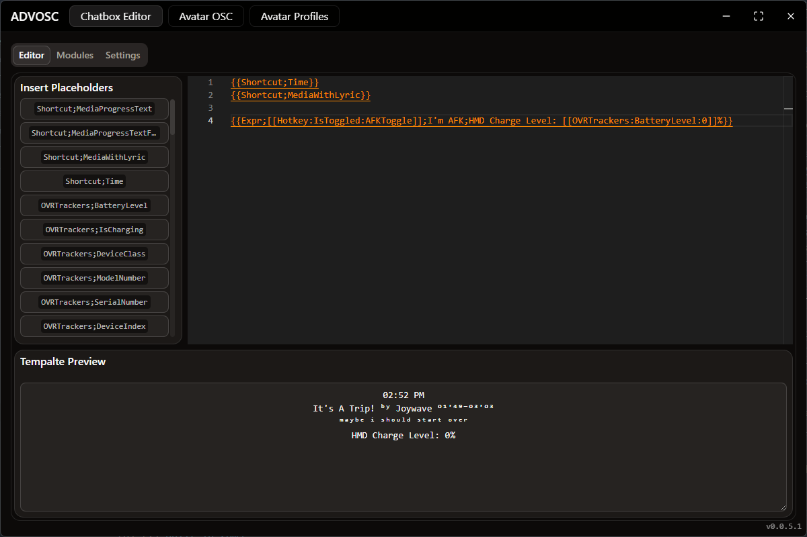
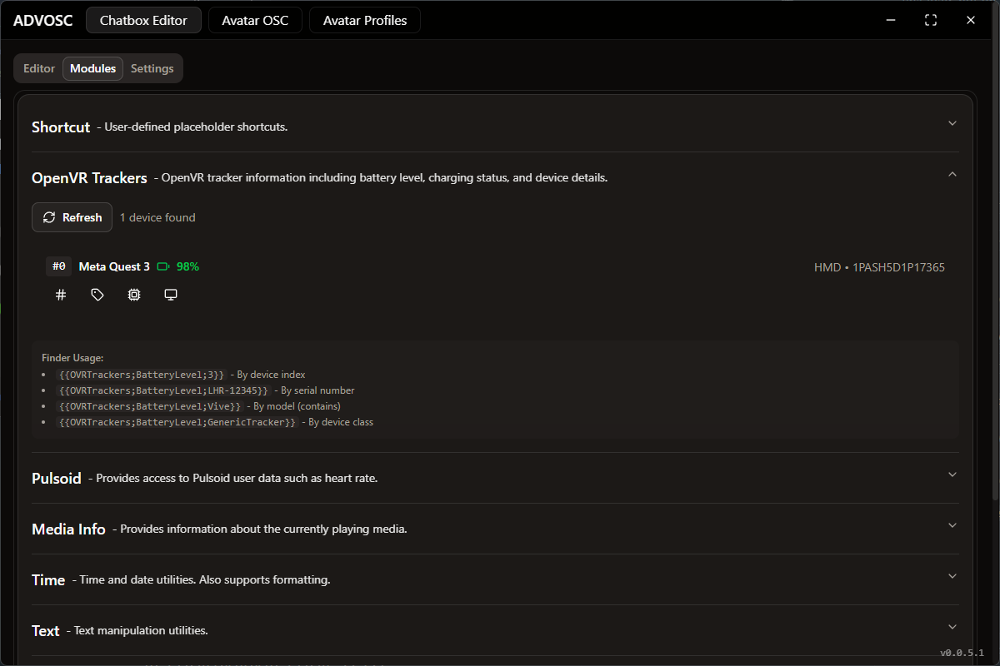
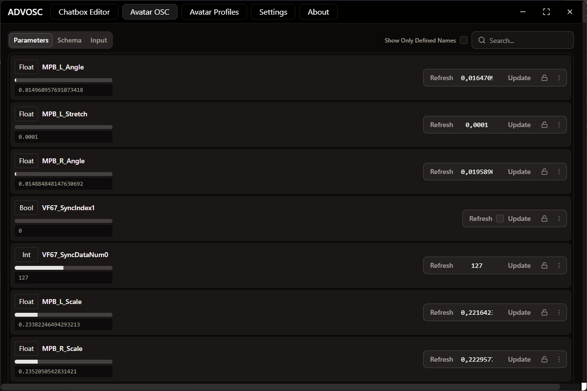
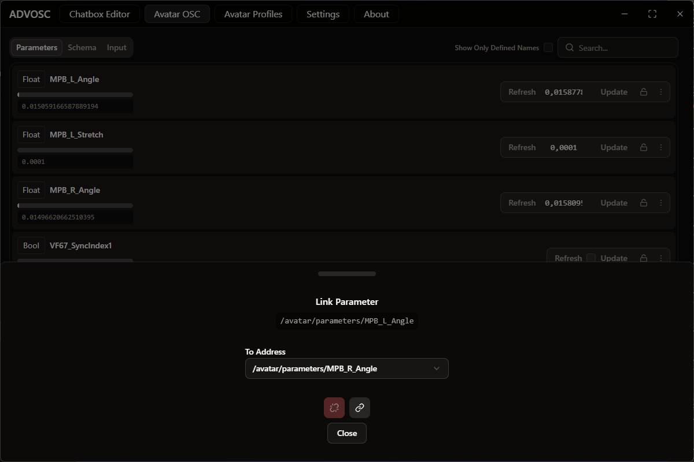
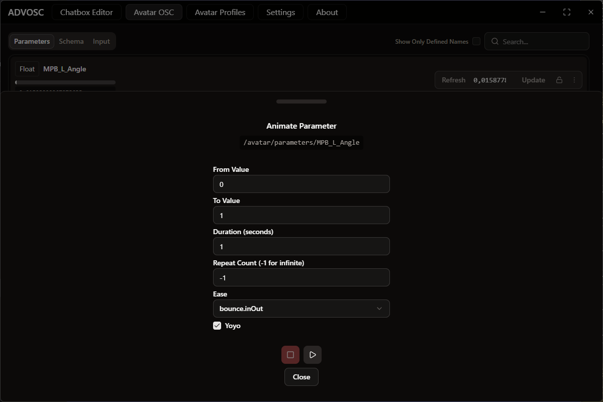
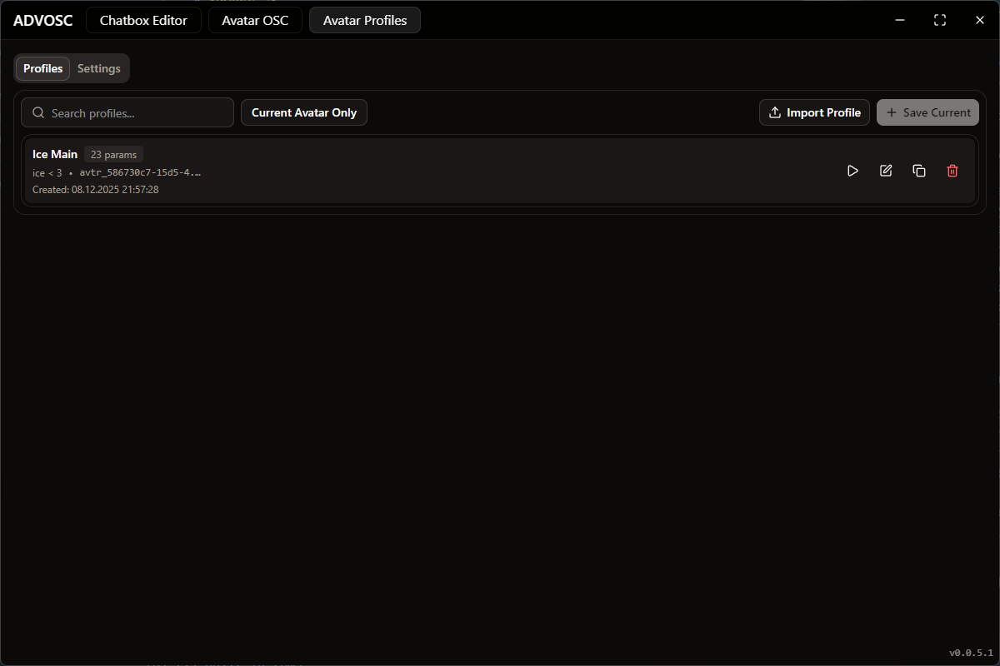

<p align="center">
  
</p>

<h1 align="center">ADVOSC</h1>

<p align="center">
  <strong>Your ultimate VRChat OSC companion</strong>
</p>

<p align="center">
  <a href="https://discord.gg/spfmB7S78n">
    
  </a>
  
  
</p>

<p align="center">
  A sleek, modern desktop application for VRChat OSC tools featuring an advanced chatbox editor with dynamic placeholders, avatar parameter control, and real-time media integration.
</p>

---

## ✨ Features

### 💬 Advanced Chatbox Editor

A powerful chatbox editor with dynamic placeholder support to make your messages come alive with real-time data.

<p align="center">
  
</p>

---

### 🧩 Chatbox Modules

The chatbox editor supports 12 powerful modules for dynamic content. Click to expand each module for details:

<details>
<summary><strong>🎵 Media Info</strong> — Display currently playing media information</summary>

Display real-time information about your currently playing media with synced lyrics support.

| Placeholder | Output | Description |
|-------------|--------|-------------|
| `{{MediaInfo;Status}}` | `Playing` | Current playback status (Playing, Paused, Stopped) |
| `{{MediaInfo;Track}}` | `Never Gonna Give You Up` | Currently playing track title |
| `{{MediaInfo;Artist}}` | `Rick Astley` | Artist name |
| `{{MediaInfo;Album}}` | `Whenever You Need Somebody` | Album name |
| `{{MediaInfo;Position}}` | `120000` | Current position in milliseconds |
| `{{MediaInfo;Duration}}` | `300000` | Total duration in milliseconds |
| `{{MediaInfo;AppName}}` | `Spotify` | Media player application name |
| `{{MediaInfo;Lyric}}` | `Never gonna give you up` | Current synced lyric line |

</details>

<details>
<summary><strong>🕒 Time</strong> — Date, time, and duration utilities</summary>

Comprehensive time and date formatting with timezone support.

| Placeholder | Output | Description |
|-------------|--------|-------------|
| `{{Time;NowMillis}}` | `1700000000000` | Current time in milliseconds (Unix epoch) |
| `{{Time;Now;HH:mm}}` | `14:30` | Current time with custom format |
| `{{Time;Now;yyyy-MM-dd}}` | `2023-11-14` | Current date with custom format |
| `{{Time;Timezone}}` | `America/New_York` | System timezone identifier |
| `{{Time;UTCOffset}}` | `+00:00` | Current UTC offset |
| `{{Time;FormatDuration;3600000;Short}}` | `1h 0m 0s` | Format milliseconds as duration |
| `{{Time;ElapsedMillis;...}}` | `5000` | Elapsed time since timestamp |

</details>

<details>
<summary><strong>🔤 Text</strong> — Text manipulation and animations</summary>

Transform and animate text with various effects.

| Placeholder | Output | Description |
|-------------|--------|-------------|
| `{{Text;Upper;hello}}` | `HELLO` | Convert to uppercase |
| `{{Text;Lower;HELLO}}` | `hello` | Convert to lowercase |
| `{{Text;Title;hello world}}` | `Hello World` | Convert to title case |
| `{{Text;Length;hello}}` | `5` | Get text length |
| `{{Text;Reverse;hello}}` | `olleh` | Reverse text |
| `{{Text;Repeat;3;Hi }}` | `Hi Hi Hi ` | Repeat text N times |
| `{{Text;Slice;0;5;Hello World}}` | `Hello` | Extract substring |
| `{{Text;Format;Rounded;text}}` | `ⓣⓔⓧⓣ` | Apply special formatting |
| `{{Text;Truncate;10;Long text...}}` | `Long text...` | Truncate with ellipsis |
| `{{Text;Animate;Marquee;...}}` | `scrolling` | Animated marquee effect |
| `{{Text;Animate;EachOne;A;B;C}}` | `A` → `B` → `C` | Cycle through items |

</details>

<details>
<summary><strong>🔢 Number</strong> — Math operations and random numbers</summary>

Mathematical operations and random number generation.

| Placeholder | Output | Description |
|-------------|--------|-------------|
| `{{Number;Random;Int;1;100}}` | `42` | Random integer between min and max |
| `{{Number;Random;Float;0;1}}` | `0.7531` | Random float between min and max |
| `{{Number;Clamp;150;0;100}}` | `100` | Clamp value between min and max |
| `{{Number;Map;5;0;10;0;100}}` | `50` | Map value from one range to another |
| `{{Number;Floor;3.7}}` | `3` | Round down |
| `{{Number;Ceil;3.2}}` | `4` | Round up |
| `{{Number;Round;3.5}}` | `4` | Round to nearest integer |
| `{{Number;Abs;-5}}` | `5` | Absolute value |

</details>

<details>
<summary><strong>🧪 Expression</strong> — Logic and math expressions</summary>

Evaluate conditions and mathematical expressions.

| Placeholder | Output | Description |
|-------------|--------|-------------|
| `{{Expr;5 > 3;Yes;No}}` | `Yes` | Conditional evaluation |
| `{{Expr;Math.sqrt(16)}}` | `4` | Math expressions |
| `{{Expr;Math.sin(Math.PI/2)}}` | `1` | Trigonometric functions |
| `{{Expr;[[MediaInfo:Status]]=='Playing';🎵;⏸️}}` | `🎵` | Dynamic conditions |

</details>

<details>
<summary><strong>❤️ Pulsoid</strong> — Heart rate monitoring</summary>

Display real-time heart rate data from Pulsoid.

| Placeholder | Output | Description |
|-------------|--------|-------------|
| `{{Pulsoid;TOKEN;HeartRate}}` | `75` | Current heart rate |
| `{{Pulsoid;TOKEN;IsOnline}}` | `true` | Connection status |
| `{{Pulsoid;TOKEN;AverageHR;300}}` | `72` | Average HR over N seconds |
| `{{Pulsoid;TOKEN;MaxHR}}` | `120` | Session maximum heart rate |
| `{{Pulsoid;TOKEN;MinHR}}` | `55` | Session minimum heart rate |

</details>

<details>
<summary><strong>📡 OSC Data</strong> — Read avatar OSC parameters</summary>

Access raw OSC parameter values from your avatar.

| Placeholder | Output | Description |
|-------------|--------|-------------|
| `{{OSCData;/avatar/parameters/AFK}}` | `true` | Read any OSC parameter value |
| `{{OSCData;/avatar/parameters/VelocityX}}` | `0.5` | Read float parameters |

</details>

<details>
<summary><strong>🎮 OpenVR Trackers</strong> — VR tracker information</summary>

Monitor your VR trackers' battery and status.

<p align="center">
  
</p>

| Placeholder | Output | Description |
|-------------|--------|-------------|
| `{{OVRTrackers;BatteryLevel;finder}}` | `85` | Battery level (0-100) |
| `{{OVRTrackers;IsCharging;finder}}` | `true` | Charging status |
| `{{OVRTrackers;ModelNumber;finder}}` | `Vive Tracker 3.0` | Tracker model |
| `{{OVRTrackers;SerialNumber;finder}}` | `LHR-12345678` | Serial number |
| `{{OVRTrackers;IsExists;finder}}` | `true` | Check if tracker exists |

*Finder can be device index, serial number, device class, or model number.*

</details>

<details>
<summary><strong>⚙️ Process</strong> — Monitor running processes</summary>

Track process information and session times.

| Placeholder | Output | Description |
|-------------|--------|-------------|
| `{{Process;IsRunning;VRChat.exe}}` | `true` | Check if process is running |
| `{{Process;StartedAt;VRChat.exe}}` | `1700000000000` | Process start timestamp |
| `{{Process;SessionTime;VRChat.exe}}` | `3600000` | Time since process started |

</details>

<details>
<summary><strong>⌨️ Hotkey</strong> — Keyboard shortcuts</summary>

Create interactive hotkey-triggered content.

| Placeholder | Output | Description |
|-------------|--------|-------------|
| `{{Hotkey;IsPressed;MyHotkey;1000}}` | `true` | Check if pressed within timeout |
| `{{Hotkey;IsToggled;MyHotkey}}` | `false` | Toggle state (press to switch) |

</details>

<details>
<summary><strong>⏱️ Stopwatch</strong> — Hotkey-controlled timers</summary>

Create stopwatches controlled by hotkeys from the Hotkey module. Perfect for afk detection, session tracking, or any timed activities.

| Placeholder | Output | Description |
|-------------|--------|-------------|
| `{{Stopwatch;ElapsedMs;MyTimer}}` | `125000` | Elapsed time in milliseconds |
| `{{Stopwatch;IsRunning;MyTimer}}` | `true` | Whether stopwatch is actively running |
| `{{Stopwatch;IsPaused;MyTimer}}` | `false` | Whether stopwatch is paused |

**Hotkey Actions:**
- **Start/Toggle** — Start or pause the stopwatch
- **Pause** — Pause without resetting
- **Reset** — Reset to zero (keeps running if active)
- **Stop** — Reset and pause completely
- **Reset + Start** — Reset to zero and immediately start (perfect for afk detection!)

</details>

<details>
<summary><strong>📝 Shortcut</strong> — Custom placeholder shortcuts</summary>

Define your own reusable placeholder shortcuts.

Create custom shortcuts that expand to complex placeholder combinations. Perfect for frequently used patterns!

</details>

---

### 🎭 Avatar OSC Control

Take full control of your avatar's parameters with powerful tools.

<p align="center">
  
</p>

| Feature | Description |
|---------|-------------|
| **🔒 Parameter Locking** | Lock toggles to prevent accidental changes |
| **🔗 Link & Redirect** | Route one parameter's value to another |
| **✨ Animate Parameters** | Create breathing effects, color shifts, and more |

<p align="center">
  
  
</p>

---

### 👗 Avatar Profiles

Save and restore your avatar's parameter configurations instantly.

<p align="center">
  
</p>

| Feature | Description |
|---------|-------------|
| **💾 Save Profiles** | Capture outfits, toggles, props, and moods |
| **⚡ Quick Load** | Restore any profile with a single click |
| **📤 Export & Import** | Share profiles or back them up as JSON |
| **🔍 Search & Filter** | Find profiles by name or filter by avatar |

---

## 🚧 Coming Soon

- **🗣️ Speech to Text & Translation** — Speak and let your words flow into the chatbox, automatically translated

---

## 🛠️ Development

This project uses [Bun](https://bun.sh/), [Electron](https://www.electronjs.org/), [Svelte 5](https://svelte.dev/), and [Rust](https://www.rust-lang.org/).

```bash
# Install dependencies
bun install

# Start development server
bun run dev

# Build for production
bun run build

# Create distributable
bun run package
```

---

## 📄 License

Distributed under the **GPL-3.0 License**.

---

<p align="center">
  Made with ❤️ for the VRChat Community
</p>